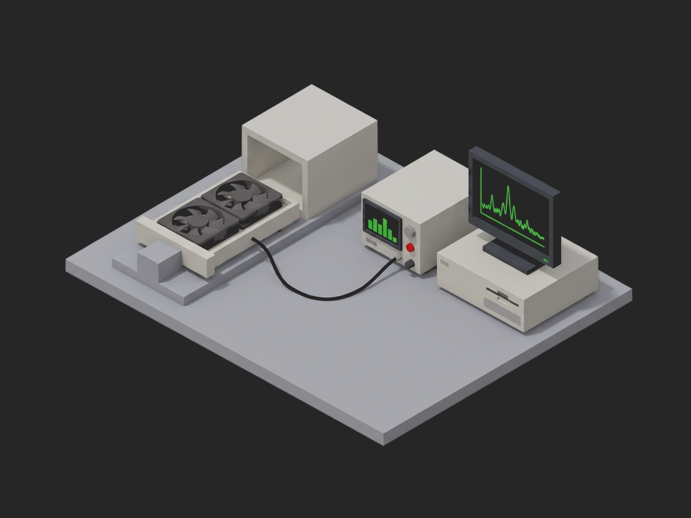

# Framework Server Fan Tray End-of-Line Test



A TofuPilot Framework procedure for the end-of-line test of a dual-rotor 80 mm 12 V hot-swap fan tray for a 2U server: insulation resistance and dielectric strength against the sled with the supply off, the FRU EEPROM read through the hot-swap connector and compared as one object with the release, both rotors through the PWM duty points against their own nominal curve with the 20 percent point checked against the Intel minimum-speed rule and the two rotors checked against each other, a cold start at 13.2 V with the tray current and both tachs recorded whole, tach pulses per revolution counted against the fixture's optical tach, the PWM frequency behind the tray's buffer, airflow and static pressure walked from free air to shut-off on the AMCA 210 chamber with the chassis design point interpolated, the sled's vibration spectrum judged on the 1x tone of each rotor and on the ball-pass tones of each bearing, sound pressure at 1 m, and a teardown that parks the tray, counts the power cycles it received and attaches the raw accelerometer capture. The mock benches synthesize a healthy tray on its nominal curve with new bearings; the 60 s dielectric dwell and the spin-up return without waiting.

## What This Shows

| Feature | Where |
|---------|-------|
| Operator radio and switch bound to validated measurements, pre-baked for headless runs | `identify_and_insulation` -- `bind: measurements.latch_airflow` (`== front-to-back`), `bind: measurements.grille_seated` (`== true`), `ui.json` |
| A previous phase's result injected as a parameter | `startup_current(measurements, bench, pwm_rpm_curve, log)` reads `pwm_rpm_curve.full_speed_a_rpm` as the spin-up reference |
| Station-scoped plug held across trays | `plugs/flow_bench.py` -- `scope: station`, the chamber and its connector mating counter |
| Multi-dimensional measurements with aggregations per axis | `pwm_curve` (`max_dev_pct`, `min_speed_pct`, `at_100_pct_a`), `startup` (`peak_a`, `t90_s`), `fan_curve` (`free_air_cfm`, `shutoff_pa`, `at_design_cfm_pa`), `spectrum` (`one_x_a_g`, `bearing_a_g`, ...) |
| A waveform recorded whole, judged on one number per axis | `startup` -- 1 750 samples of current and both tachs, three aggregations |
| JSON `==` on a whole object, integer `==`, string `==` | `fru_identity`, `tach_pulses_per_rev_a == 2`, `latch_airflow` |
| `unit.metadata`, `run.metadata` and `attach.data` from the teardown | `phases/park_and_cycles.py` -- `power_cycles` on the unit, `fixture_matings` on the run, `vibration_raw_20khz.csv` attached from the bench's cached capture |
| Sequential `depends_on` chain on one supply and one chamber, a `timeout` for the chamber | every `main:` phase, `timeout: 5m` on `airflow_and_pressure` |

## Get Started

1. Sign up for a free TofuPilot account at [tofupilot.app](https://www.tofupilot.app/auth/signup).
2. Open the **New Procedure** flow in the dashboard and clone this template.
3. Follow the dashboard's instructions to set up a station and run the procedure.

For deeper guides, see the [TofuPilot docs](https://www.tofupilot.com/docs/framework) and the [Server Fan Tray End-of-Line Test template page](https://www.tofupilot.com/templates/server-fan-tray-end-of-line-test).

Headless (pre-baked operator input for the latch and the finger guard):

```bash
tofupilot run . --no-tui --no-kiosk --json --ui-values ui.json
```

## Structure

```
.
├── procedure.yaml                    # Procedure, plugs, phases, measurements
├── phases/
│   ├── identify_and_insulation.py    # Setup: IR and dielectric with the supply off, FRU EEPROM, operator answers
│   ├── pwm_rpm_curve.py              # Both rotors through 20 to 100 % duty, curve, min speed, mismatch
│   ├── startup_current.py            # 0 to 100 % step at 13.2 V, current and tachs whole, peak and t90
│   ├── tach_integrity.py             # Pulses per revolution against the optical tach, tach duty, PWM frequency
│   ├── airflow_and_pressure.py       # Damper from open to shut on the chamber, free air, shut-off, design point
│   ├── vibration_and_acoustic.py     # Sled spectrum: 1x per rotor, ball-pass tones per bearing, dBA at 1 m
│   └── park_and_cycles.py            # Teardown: PWM 0, supply off, cycles on the unit, raw capture attached
├── plugs/
│   ├── fan_bench.py                  # Mock supply + PWM/tach counters + optical tach + accelerometer + SLM + safety analyzer + FRU I2C
│   └── flow_bench.py                 # Mock AMCA 210 chamber with damper and mating counter (station scope)
├── utils/
│   └── recipe.py                     # Ratings, stimulus, where each limit comes from
├── ui.json                           # Operator input for headless runs
├── pyproject.toml                    # uv-managed Python project
└── README.md
```

## Replace the Mock with Real Hardware

`plugs/fan_bench.py` maps to six links: the 12 V supply over SCPI (a Keysight N6700C mainframe with an N6754A module, whose current digitizer gives the start-up waveform), a DAQ with counters (NI USB-6363) for the two PWM outputs at 25 kHz, the two tach inputs and the optical tach on each hub, its IEPE analog input for the accelerometer on the sled (PCB 352C33 through a 482C05 conditioner), a class 1 sound level meter at 1 m on the inlet axis (NTi Audio XL2), the electrical safety analyzer (Chroma 19032) for the 500 Vdc insulation resistance and the 500 Vac dielectric test, and an I2C adapter on the hot-swap connector's SMBus pins for the FRU EEPROM. `plugs/flow_bench.py` maps to the chamber's own serial protocol: damper position, nozzle differential pressure and chamber static pressure. Interlock the safety analyzer against the supply, wait for each damper point to settle before reading, and keep the chamber plug at `scope: station` so the damper stays homed and the mating counter keeps counting from one tray to the next. The phases, measurements and limits stay the same.
